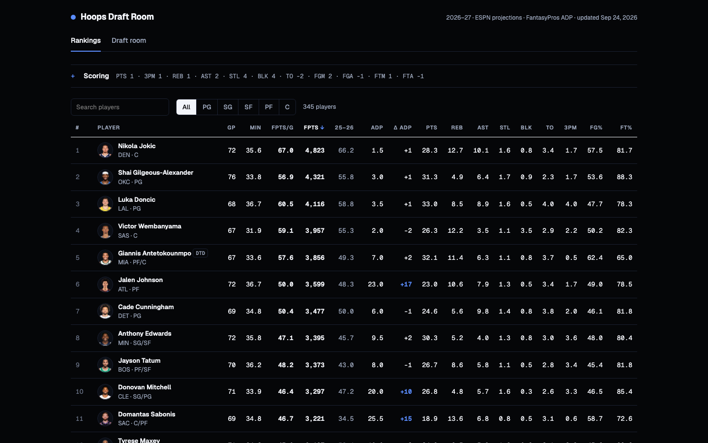

# Hoops Draft Room

A fantasy basketball draft companion for the 2026–27 season: sortable
player rankings under your league's scoring, plus a live snake-draft room
with pick recommendations, team ratings, and a draft-slot simulator.



**Live demo:** _add GitHub Pages link here_

## What it does

- **Rankings.** Projected fantasy points under configurable category
  scoring, with position filters, search, ADP, and how far each player's
  value differs from where they're being drafted (Δ ADP).
- **Draft room.** Runs a full snake draft against bot drafters, recommends
  your next pick, and grades every team as the draft unfolds.
- **Draft slot comparison.** Simulates many drafts from every slot against
  a mix of bot drafting styles to show which slot is strongest.

## Design notes

<!-- Fill these in. This is the part a UX reviewer reads most closely. -->

- **Who it's for / the problem:** _What was frustrating about existing
  draft tools? Who did you build it for (yourself, your league)?_
- **Key decisions:** _Why a dense data table instead of cards? How did you
  decide which columns to show by default? Why highlight Δ ADP?_
- **Feedback & iteration:** _Did leaguemates use it during a real draft?
  What did you change after watching them?_
- **What I'd do next:** _…_

## How it's built

Single-file web app (HTML/CSS/vanilla JS) with no runtime dependencies.
Data is pre-built by two Python scripts and embedded into the page:

```bash
python tools/build_data.py   # merges ESPN projections, FantasyPros ADP, Basketball-Reference stats
python tools/build_page.py   # assembles index.html from tools/template.html + data
```

Data sources: ESPN Fantasy projections, FantasyPros consensus ADP,
Basketball-Reference. Player headshots © ESPN. Not affiliated with any of
these sites.
